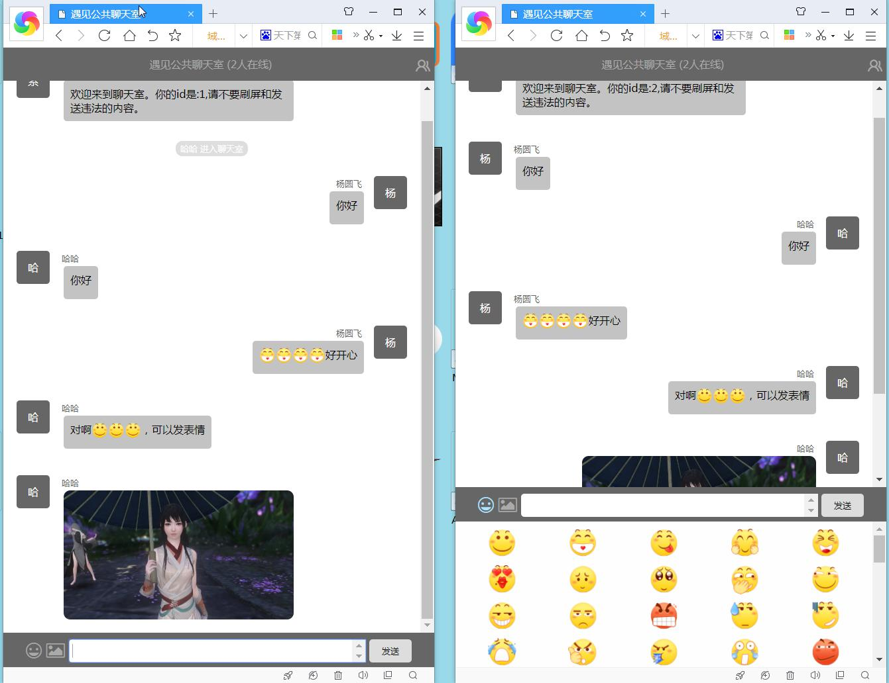
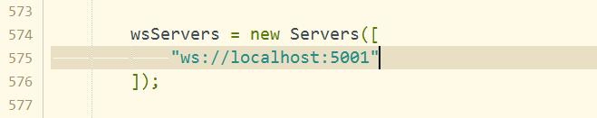

前置条件：`windows7 python3.7.2 flask 1.0.2`

项目简介：
用python模仿了项目websocketd。因为自己实现websocekt还是比较困难的
，所以直接使用webscoket-sever这个模块。
在自己的websocketd的基础上开发了一个简单的聊天室。

启动：双击 `start.bat`

功能效果：可以发文字、表情和图片

请更改 `templates/index.html` 以适用你自己的服务环境。如下：

